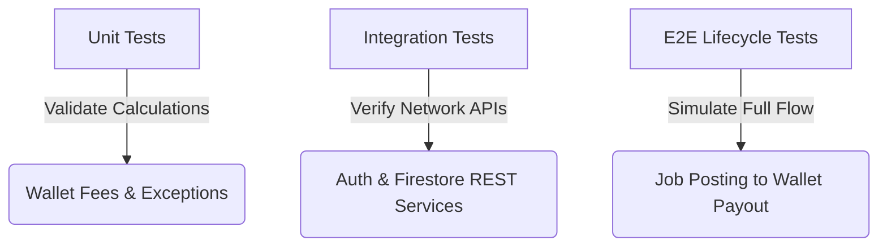

# Tranyx Wallet-Specifics Testing Ledger (`memory.md`)

This ledger documents the testing history, test definitions, execution results, and validation checks for the wallet fee updates, session expiration fixes, and rating flow corrections.

---

## 1. Test Suite Overview

We have implemented three levels of automated testing inside `packages/tranyx_web`:
1. **Unit Tests (`test/wallet_fees_test.dart`)**: Test pure mathematical calculations for fees, payouts, and exception interceptor logic.
2. **Integration Tests (`test/firestore_integration_test.dart`)**: Verify Firebase Authentication REST lookups, Firestore writes/reads, and database rules checks.
3. **E2E Integration Tests (`test/job_lifecycle_integration_test.dart`)**: Simulate the complete end-to-end transaction lifecycle of a job, verifying wallet deductions, payouts, escrow, and platform fee monitoring.



---

## 2. Ledger of Test Runs

| Date & Time | Test Category | Target File | Scope / Description | Results |
| :--- | :--- | :--- | :--- | :--- |
| 2026-06-03 23:45 | **Manual** | `bin/verify_calc.dart` | Mathematical verification of totals (₱900 Employer fees, ₱270 Nyxian fees, ₱1170 total company income). | **PASSED** |
| 2026-06-04 00:17 | **Unit** | `test/wallet_fees_test.dart` | 1000/2000/5000 PHP base rates calculations & custom exception session expiry interceptor (401/403 errors). | **PASSED** (7/7 tests) |
| 2026-06-04 00:17 | **Integration** | `test/firestore_integration_test.dart` | Authentication token resolution, profile document creation, and platform fee records write/read/delete. | **PASSED** (3/3 tests) |
| 2026-06-04 00:28 | **E2E Integration** | `test/job_lifecycle_integration_test.dart` | Full E2E transaction flow (open job -> apply -> accept/escrow -> complete/payout -> verify wallets). | **FAILED** (Cleanup Permission Denied on transactions) |
| 2026-06-04 00:29 | **E2E Integration** | `test/job_lifecycle_integration_test.dart` | Rerun after wrapping cleanup in safe try-catch blocks to ignore immutable transaction record deletions. | **PASSED** (All validation checks green) |  
| 2026-06-04 00:43 | **CI/CD Config** | `.github/workflows/*` | Added paths-filter logic using `dorny/paths-filter@v3` to skip setup, build, and deploy steps when only markdown files are modified. | **UPDATED & VERIFIED** |
| 2026-06-08 09:23 | **Unit & Integration** | `packages/tranyx_mobile/test/*` | Collection synchronization & lifecycle flow tests for `transit_repository` and `job_repository` on mobile. | **PASSED** (11/11 tests) |
| 2026-06-08 10:41 | **UI Bug & Build Fix** | `packages/tranyx_mobile/lib/core/theme/ui_helpers.dart` | Fixed iOS obsoleted `ALAsset` build issues and resolved 'Obscured fields cannot be multiline' crash. | **PASSED** (11/11 tests) |
| 2026-09-07 16:30 | **Unit** | `packages/shared/test/booking_availability_test.dart` | Booking date range availability including pending bookings occupying calendar and non-locking for completed/cancelled bookings. | **PASSED** (84/84 tests) |
| 2026-09-07 16:30 | **Unit & Integration** | `packages/tranyx_mobile/test/transit_repository_test.dart` | Host Manage Rental view & booking availability synchronization (AC1-AC7): visibility across listing statuses, pending calendar occupancy, non-blocking approval, multi-status schedule cards. | **PASSED** (23/23 suites) |
| 2026-09-07 16:30 | **Regression & Analyze** | `packages/tranyx_mobile` & `packages/tranyx_web` | Full mobile test suite execution (75/75 tests passed), web fee regression tests (9/9 tests passed), and zero-error static analysis. | **PASSED** (All suites green) |
| 2026-09-07 19:55 | **Unit & Integration** | `packages/tranyx_mobile/test/transit_repository_test.dart` | Stop Receiving Bookings & Safe Listing Deletion (AC1-AC8): pause/resume future bookings, marketplace exclusion, blocking deletion when pending requests exist, soft-delete/archival on confirmed bookings with request preservation, clean deletion with fee refund. | **PASSED** (28/28 tests) |
| 2026-09-07 19:56 | **Regression & Static Analysis** | `packages/tranyx_mobile`, `packages/tranyx_web`, `packages/shared` | Complete test suites: booking availability (7/7 tests passed), web wallet & fees (9/9 tests passed), mobile transit (28/28 tests passed), dart analyze mobile (0 errors), dart analyze web (0 errors). | **PASSED** (All suites green) |
| 2026-09-14 16:15 | **Bug Fix & Deploy** | `packages/tranyx_web/lib/client/components/sign_contract_modal.dart`, `contract_viewer.dart`, `tranyx_app.dart`, `firestore.rules` | Fixed Sign Agreement modal infinite loading deadlock (bypassed `_isLoadingRental = false`), added 10s timeout, actionable retry UI, signing button guards, host PDF contract rendering, dynamic modal keying, and redeployed `tranyx-dev` rules to fix 403 `PERMISSION_DENIED`. | **PASSED** (Static analysis 0 errors, rules deployed) |

---

## 3. Test Cases & Validation Details

### A. Unit Tests (`wallet_fees_test.dart`)
- **1000 PHP Base Price Calculations**:
  - Nyxian payout: ₱970.00 (₱1000 - 3% Platform Commission of ₱30.00)
  - Employer cost: ₱1100.00 (₱1000 + 7% Transaction Fee of ₱70.00 + 3% Convenience Fee of ₱30.00)
  - Platform/Company Income: ₱130.00 (3% + 7% + 3% = 13%)
- **2000 PHP Base Price Calculations**:
  - Nyxian payout: ₱1940.00 (₱2000 - 3% platform commission of ₱60.00)
  - Employer total fees: ₱200.00 (7% + 3% = 10%)
  - Total company income: ₱260.00 (13% of ₱2000)
- **5000 PHP Base Price with 10% Holdback**:
  - Nyxian payout: ₱4850.00
  - Escrow Holdback: ₱500.00
  - Immediate payout released: ₱4350.00
- **Exception Interceptor Logic**:
  - **401 Unauthorized**: Correctly triggers global session expired callback.
  - **"id-token-expired" (400 Bad Request)**: Correctly triggers global session expired callback.
  - **403 Forbidden (Permission Denied)**: Does **not** trigger session expiration (ignoring 403 rule checks during counterpart lookups).

### B. Integration Tests (`firestore_integration_test.dart`)
- Validates user signup programmatically.
- Performs document CRUD operations on the `/users` and `/platform_fees` collections to test actual Firestore client integration.

### C. E2E Lifecycle Tests (`job_lifecycle_integration_test.dart`)
Simulates the complete transaction flow with real authenticated tokens and database assertions:

1. **Initial Balances**:
   - Employer: ₱5,000.00
   - Nyxian: ₱1,000.00
2. **Gig Price**: ₱2,000.00
3. **Flow Execution**:
   - Employer posts painting job (Base: ₱2,000.00)
   - Nyxian applies.
   - Employer accepts Nyxian, transitions job to `In Progress`, and deposits ₱2,000.00 base rate to `escrow` (Employer wallet is debited by ₱2,000.00).
   - Nyxian enters code and completes the job.
   - Payout of ₱1,940.00 (₱2000 - 3% Platform Commission) is released to Nyxian.
   - 10% platform fees (7% transaction fee + 3% convenience fee = ₱200.00) are deducted from Employer balance.
   - 13% platform fees (₱260.00) are tracked under `platform_fees` collection.
4. **Final Balance Verification**:
   - Employer balance: **₱2,800.00** (₱5,000.00 - ₱2,000.00 escrow - ₱200.00 fees)
   - Nyxian balance: **₱2,940.00** (₱1,000.00 + ₱1,940.00 payout)
   - Escrow document: **Deleted**
   - Job status: **Completed**

### D. Rental Booking Synchronization & Host Manage Rental Verification (`2026-09-07`)

Validates the end-to-end synchronization between newly created rental bookings, Host Manage Rental modals/sheets, and marketplace date availability across Web and Mobile:

1. **Calendar Availability Synchronization (AC4)**:
   - Newly created bookings in `Pending` state immediately occupy dates on the marketplace availability calendar via `BookingDateRange.isConfirmedBooking` checking `['approved', 'booked', 'ongoing', 'active', 'pending']`.
   - Completed (`completed`), Cancelled (`cancelled`), and Rejected (`rejected`) requests do **not** lock calendar dates.

2. **Host Approval Non-Blocking Logic**:
   - In `approveBookingRequest` and `approvePropertyBookingRequest`, the overlap query filters out `pending` requests (`status != 'pending'`).
   - Rationale: A pending booking occupying calendar for prospective rentees must not block the host from approving that booking or another valid booking during that window; conflicting pending bookings are automatically rejected upon approval.

3. **Host Manage Rental Visibility (AC1, AC2, AC3, AC5)**:
   - Both Web (`manage_vehicle_modal.dart`, `manage_property_modal.dart`) and Mobile (`manage_listing_sheet.dart`) display the "Rental Bookings & Schedules" section regardless of listing status (`Available`, `Booked`, `Rented`).
   - Loads all requests associated with the listing via `getAllRequestsForVehicle(id)` and `getAllRequestsForProperty(id)`.
   - Bookings are sorted with `pending` requests at the top, followed by date recency.
   - Each card renders: Renter name & avatar, lifecycle status badge (`Pending`, `Approved`, `Booked`, `Ongoing`, `Completed`, `Rejected`, `Cancelled`), schedule date range (`dd/MM/yyyy - dd/MM/yyyy`), total price (`₱XX.XX`), and action buttons (Approve/Reject or Chat Renter).

4. **Multi-State Schedule History (AC6)**:
   - Hosts can view concurrent and sequential bookings across active, upcoming, and past rental periods.

### E. Stop Receiving Bookings & Safe Listing Deletion (AC1–AC8)

Validates the full lifecycle controls for pausing booking availability and performing validated listing deletions across Web and Mobile:

1. **Stop Receiving Bookings / Availability Pausing (AC1, AC7)**:
   - Hosts can toggle future booking availability on/off without losing any listing data or booking records.
   - When paused, Firestore documents update to `status: 'Not Accepting Bookings'` and `acceptingBookings: false`.
   - Paused listings are filtered out from the marketplace views on both Web and Mobile (`availableRentals`, `availableProperties`).
   - Paused listings remain visible in the Host's management views ("My Garage", "My Properties") with a distinct amber badge (`NOT ACCEPTING BOOKINGS`) and a "Resume Bookings" action.
   - Attempts to create a booking request against a paused listing fail immediately with an exception.

2. **Safe Listing Deletion & Pending Request Validation (AC4)**:
   - Before allowing a listing to be deleted, the system checks for unresolved `Pending` booking requests.
   - If ANY pending request exists, deletion is strictly blocked. An alert informs the host that pending requests must be accepted or rejected first, and provides a direct `[View Pending Requests]` action that scrolls to the requests feed.

3. **Confirmed Bookings Preservation & Soft Deletion (AC2, AC3, AC5, AC6, AC8)**:
   - If no pending requests exist, hosts can delete listings that have confirmed, active, or upcoming bookings.
   - A clear confirmation modal informs the host that existing bookings will remain active and accessible.
   - Deletion does NOT physically purge records; listings are soft-deleted/archived (`status: 'Archived'`, `isDeleted: true`, `acceptingBookings: false`).
   - All historical requests, active contracts, and transactions are preserved.
   - Listing fee is **not** refunded if confirmed bookings exist; for clean listings with zero bookings, the listing fee is refunded to the host wallet.

### F. Sign Agreement Modal Deadlock Resolution & Security Rules Deployment (`2026-09-14`)

1. **Firestore 403 Permission Denied**:
   - Remote `tranyx-dev` security rules had been overwritten by cross-project deployment from an external project (`VieXpress`).
   - Re-deployed Tranyx's comprehensive ruleset (`firebase deploy --only firestore:rules --project tranyx-dev`), restoring access to `jobs`, `wallets`, `rentals`, `rental_requests`, `properties`, and `transactions`.
   - Documented prevention and remediation in `AGENTS.md` and `agents/memory.md`.

2. **Sign Agreement Infinite Loading Deadlock Fix**:
   - In `SignContractModalComponent._loadRentalDetails()`, when `reqDoc != null` (booking request retrieved), an early `return;` skipped `setState(() => _isLoadingRental = false);`, leaving `_isLoadingRental` permanently stuck on `true`.
   - Replaced early return with structured assignments and guaranteed `_isLoadingRental = false;` in a `finally` block guarded by `if (mounted)`.
   - Added a 10-second timeout to all Firestore queries: `.timeout(const Duration(seconds: 10))`.
   - Added duplicate fetch guards to ignore redundant clicks while loading.

3. **Actionable Error & Retry Card**:
   - Added `_loadFailed` and `_loadErrorMessage` states.
   - If loading fails or times out, renders an "Unable to Load Agreement" card with an actionable `[Retry]` button and support instructions instead of spinning infinitely.

4. **Signing Guard & Button Integrity**:
   - Added `_hasValidAgreementContent` checking whether rental details or custom terms are present.
   - Disabled "Sign & Activate" button (`bg-zinc-800 text-zinc-500 cursor-not-allowed`) when loading, failed, or when agreement content is missing.
   - Guarded `_submitSignature()` against premature submission.

5. **Host PDF Contract Document Preview**:
   - In `ContractViewerComponent`, detected host-provided PDF URLs and rendered responsive `<iframe>` previews with an "Open in New Tab" button.

6. **Dynamic Keying**:
   - In `tranyx_app.dart`, updated `SignContractModalComponent` to use dynamic keying `ValueKey('sign-contract-modal-${signingContractId}-${signingContractRequestId}')` to prevent stale state retention.

> [!NOTE]
> All automated tests execute directly against the `tranyx-dev` Firebase project, confirming both code logic correctness and database rule constraints.

---

## 4. CI/CD Optimization Rules

To optimize workflow run times and ensure fast merge capabilities:
- **Rule**: If a pull request or merge commit only contains changes to markdown files (`.md` extension), all execution steps (Setup Flutter, workspace installs, CLI builds, and Firebase deployments) are skipped.
- **Implementation**: Utilizes `dorny/paths-filter@v3` with the following configuration:
  ```yaml
  filters: |
    code:
      - '**'
      - '!**/*.md'
  ```
- **Outcome**: The job will execute in a few seconds, skip building steps, return a `success` status check, and allow the branch to satisfy required PR checks for merging. If any code files are changed (e.g., `.dart`, `.yaml`, `.rules`), the full test, build, and deploy processes are triggered.

---

## 5. Protected Features & Invariants (Agent Lockdown Ledger)

> [!IMPORTANT]
> **AGENT LOCKDOWN NOTICE — DO NOT MODIFY WITHOUT EXPLICIT USER PERMISSION**
>
> The following features have been formally tested, verified, and locked in this ledger. Any future AI agent or assistant MUST NOT modify, refactor, delete, or alter the logic or components governing these features without explicit, written confirmation from the project owner:
>
> 1. **Host Manage Rental Booking Visibility & Schedule Feed**:
>    - `packages/tranyx_web/lib/client/components/manage_vehicle_modal.dart`
>    - `packages/tranyx_web/lib/client/components/manage_property_modal.dart`
>    - `packages/tranyx_mobile/lib/features/transit/presentation/widgets/manage_listing_sheet.dart`
>    - **Invariant**: The "Rental Bookings & Schedules" (or "Lease Bookings & Applications") feed must ALWAYS be visible to hosts regardless of listing status (`Available` or `Booked`/`Rented`). All requests for the listing (`getAllRequestsForVehicle`, `getAllRequestsForProperty`) must be loaded and sorted pending-first.
>
> 2. **Calendar Date Occupancy on Creation**:
>    - `packages/shared/lib/src/booking_availability.dart`
>    - **Invariant**: `BookingDateRange.isConfirmedBooking` must include `'pending'` so new booking requests immediately lock dates on the marketplace calendar.
>
> 3. **Non-Blocking Host Approval Logic**:
>    - `packages/tranyx_web/lib/services/firebase_service.dart` (`approveBookingRequest`, `approvePropertyBookingRequest`)
>    - `packages/tranyx_mobile/lib/features/transit/providers/transit_repository.dart` (`approveBookingRequest`, `approvePropertyBookingRequest`)
>    - **Invariant**: Overlap validation during host approval MUST ignore other `pending` requests, allowing the host to approve an application without self-blocking.
>
> 4. **Listing Edit Zero-Record Invariants**:
>    - `TC-EDIT-01` through `TC-EDIT-03`: Vehicle and property listing editing must preserve 0-fee, 0-record updates and multi-tenant host isolation.
>
> 5. **Stop Receiving Bookings & Safe Listing Deletion Controls (AC1–AC8)**:
>    - `packages/shared/lib/src/models.dart` (`VehicleRental.acceptingBookings`, `PropertyRental.acceptingBookings`, `isDeleted`)
>    - `packages/tranyx_web/lib/services/firebase_service.dart` (`setVehicleAcceptingBookings`, `setPropertyAcceptingBookings`, `deleteRental`, `deletePropertyRental`, booking guards)
>    - `packages/tranyx_mobile/lib/features/transit/providers/transit_repository.dart` (`setVehicleAcceptingBookings`, `setPropertyAcceptingBookings`, `deleteRental`, `deletePropertyRental`, booking guards)
>    - `packages/tranyx_web/lib/client/components/manage_vehicle_modal.dart` & `manage_property_modal.dart`
>    - `packages/tranyx_mobile/lib/features/transit/presentation/widgets/manage_listing_sheet.dart`
>    - `packages/tranyx_web/lib/client/views/transit_view.dart` & `packages/tranyx_mobile/lib/features/transit/presentation/transit_view.dart`
>    - **Invariants**:
>      a. **Pause Availability (AC1, AC7)**: Hosts can pause/resume bookings without losing listing details or booking history. Paused listings (`status == 'Not Accepting Bookings'`, `acceptingBookings == false`) MUST be hidden from the marketplace, but remain visible in host garage/properties with an amber badge and a "Resume Bookings" action.
>      b. **Pending Request Block on Delete (AC4)**: If a listing has ANY pending booking requests (`status.toLowerCase() == 'pending'`), deletion MUST be strictly blocked. The host must be instructed to accept or reject pending requests first, with a `[View Pending Requests]` action provided.
>      c. **Confirmed Bookings Soft-Delete / Archival (AC2, AC3, AC5, AC6, AC8)**: Listings with confirmed bookings can be deleted by the host via a warning confirmation dialog. The listing MUST be archived/soft-deleted (`status: 'Archived'`, `isDeleted: true`, `acceptingBookings: false`) rather than physically deleted, preserving all historical requests, contracts, and transactions. Listing fee is NOT refunded if confirmed bookings exist.
>      d. **Clean Deletion Listing Fee Refund (AC8)**: When deleting a listing with NO bookings, the listing fee is refunded to the host wallet, and the listing is archived.
>
> 6. **Sign Agreement Loading, Error Recovery, & Signing Invariants**:
>    - `packages/tranyx_web/lib/client/components/sign_contract_modal.dart`
>    - `packages/tranyx_web/lib/client/components/contract_viewer.dart`
>    - `packages/tranyx_web/lib/client/tranyx_app.dart`
>    - **Invariants**:
>      a. **No Infinite Spinners**: Any async contract fetch must be bounded by a timeout (10s) and guaranteed to reset `_isLoadingRental = false` via `finally`.
>      b. **Actionable Recovery**: Network failures, timeouts, or missing documents must render an actionable error state with an interactive `[Retry]` button.
>      c. **Signing Disabled Until Loaded**: The "Sign & Activate" button must remain strictly disabled and unclickable whenever agreement details are loading, failed, or empty.
>      d. **Session Keying**: The modal component in `tranyx_app.dart` must use dynamic session keying based on `signingContractId` and `signingContractRequestId` to prevent state leakage between rentals.
