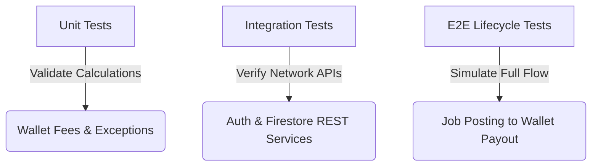

# Tranyx Wallet-Specifics Testing Ledger (`memory.md`)

This ledger documents the testing history, test definitions, execution results, and validation checks for the wallet fee updates, session expiration fixes, and rating flow corrections.

---

## 1. Test Suite Overview

We have implemented three levels of automated testing inside `packages/tranyx_web`:
1. **Unit Tests (`test/wallet_fees_test.dart`)**: Test pure mathematical calculations for fees, payouts, and exception interceptor logic.
2. **Integration Tests (`test/firestore_integration_test.dart`)**: Verify Firebase Authentication REST lookups, Firestore writes/reads, and database rules checks.
3. **E2E Integration Tests (`test/job_lifecycle_integration_test.dart`)**: Simulate the complete end-to-end transaction lifecycle of a job, verifying wallet deductions, payouts, escrow, and platform fee monitoring.



---

## 2. Ledger of Test Runs

| Date & Time | Test Category | Target File | Scope / Description | Results |
| :--- | :--- | :--- | :--- | :--- |
| 2026-06-03 23:45 | **Manual** | `bin/verify_calc.dart` | Mathematical verification of totals (₱900 Employer fees, ₱270 Nyxian fees, ₱1170 total company income). | **PASSED** |
| 2026-06-04 00:17 | **Unit** | `test/wallet_fees_test.dart` | 1000/2000/5000 PHP base rates calculations & custom exception session expiry interceptor (401/403 errors). | **PASSED** (7/7 tests) |
| 2026-06-04 00:17 | **Integration** | `test/firestore_integration_test.dart` | Authentication token resolution, profile document creation, and platform fee records write/read/delete. | **PASSED** (3/3 tests) |
| 2026-06-04 00:28 | **E2E Integration** | `test/job_lifecycle_integration_test.dart` | Full E2E transaction flow (open job -> apply -> accept/escrow -> complete/payout -> verify wallets). | **FAILED** (Cleanup Permission Denied on transactions) |
| 2026-06-04 00:29 | **E2E Integration** | `test/job_lifecycle_integration_test.dart` | Rerun after wrapping cleanup in safe try-catch blocks to ignore immutable transaction record deletions. | **PASSED** (All validation checks green) |  
| 2026-06-04 00:43 | **CI/CD Config** | `.github/workflows/*` | Added paths-filter logic using `dorny/paths-filter@v3` to skip setup, build, and deploy steps when only markdown files are modified. | **UPDATED & VERIFIED** |

---

## 3. Test Cases & Validation Details

### A. Unit Tests (`wallet_fees_test.dart`)
- **1000 PHP Base Price Calculations**:
  - Nyxian payout: ₱970.00 (₱1000 - 3% Platform Commission of ₱30.00)
  - Employer cost: ₱1100.00 (₱1000 + 7% Transaction Fee of ₱70.00 + 3% Convenience Fee of ₱30.00)
  - Platform/Company Income: ₱130.00 (3% + 7% + 3% = 13%)
- **2000 PHP Base Price Calculations**:
  - Nyxian payout: ₱1940.00 (₱2000 - 3% platform commission of ₱60.00)
  - Employer total fees: ₱200.00 (7% + 3% = 10%)
  - Total company income: ₱260.00 (13% of ₱2000)
- **5000 PHP Base Price with 10% Holdback**:
  - Nyxian payout: ₱4850.00
  - Escrow Holdback: ₱500.00
  - Immediate payout released: ₱4350.00
- **Exception Interceptor Logic**:
  - **401 Unauthorized**: Correctly triggers global session expired callback.
  - **"id-token-expired" (400 Bad Request)**: Correctly triggers global session expired callback.
  - **403 Forbidden (Permission Denied)**: Does **not** trigger session expiration (ignoring 403 rule checks during counterpart lookups).

### B. Integration Tests (`firestore_integration_test.dart`)
- Validates user signup programmatically.
- Performs document CRUD operations on the `/users` and `/platform_fees` collections to test actual Firestore client integration.

### C. E2E Lifecycle Tests (`job_lifecycle_integration_test.dart`)
Simulates the complete transaction flow with real authenticated tokens and database assertions:

1. **Initial Balances**:
   - Employer: ₱5,000.00
   - Nyxian: ₱1,000.00
2. **Gig Price**: ₱2,000.00
3. **Flow Execution**:
   - Employer posts painting job (Base: ₱2,000.00)
   - Nyxian applies.
   - Employer accepts Nyxian, transitions job to `In Progress`, and deposits ₱2,000.00 base rate to `escrow` (Employer wallet is debited by ₱2,000.00).
   - Nyxian enters code and completes the job.
   - Payout of ₱1,940.00 (₱2000 - 3% Platform Commission) is released to Nyxian.
   - 10% platform fees (7% transaction fee + 3% convenience fee = ₱200.00) are deducted from Employer balance.
   - 13% platform fees (₱260.00) are tracked under `platform_fees` collection.
4. **Final Balance Verification**:
   - Employer balance: **₱2,800.00** (₱5,000.00 - ₱2,000.00 escrow - ₱200.00 fees)
   - Nyxian balance: **₱2,940.00** (₱1,000.00 + ₱1,940.00 payout)
   - Escrow document: **Deleted**
   - Job status: **Completed**

> [!NOTE]
> All automated tests execute directly against the `tranyx-dev` Firebase project, confirming both code logic correctness and database rule constraints.

---

## 4. CI/CD Optimization Rules

To optimize workflow run times and ensure fast merge capabilities:
- **Rule**: If a pull request or merge commit only contains changes to markdown files (`.md` extension), all execution steps (Setup Flutter, workspace installs, CLI builds, and Firebase deployments) are skipped.
- **Implementation**: Utilizes `dorny/paths-filter@v3` with the following configuration:
  ```yaml
  filters: |
    code:
      - '**'
      - '!**/*.md'
  ```
- **Outcome**: The job will execute in a few seconds, skip building steps, return a `success` status check, and allow the branch to satisfy required PR checks for merging. If any code files are changed (e.g., `.dart`, `.yaml`, `.rules`), the full test, build, and deploy processes are triggered.
